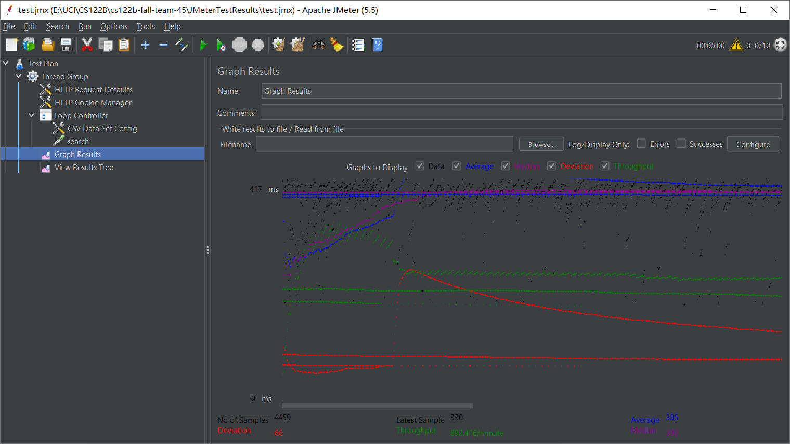
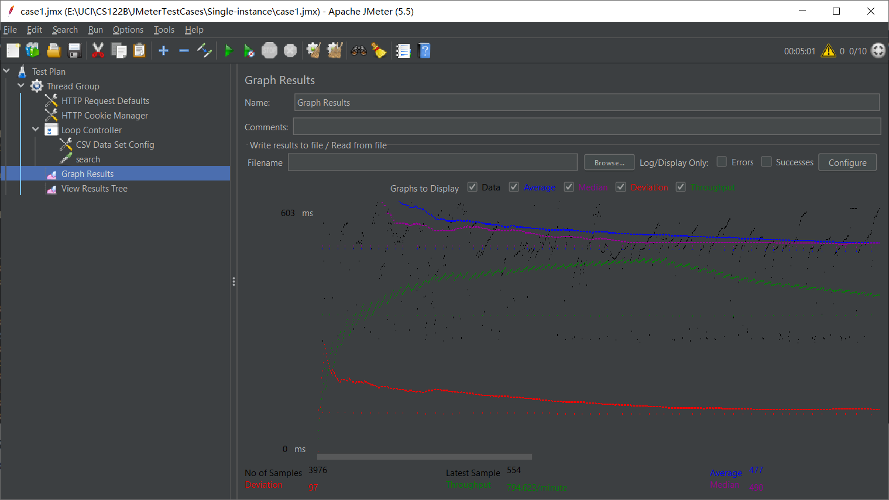
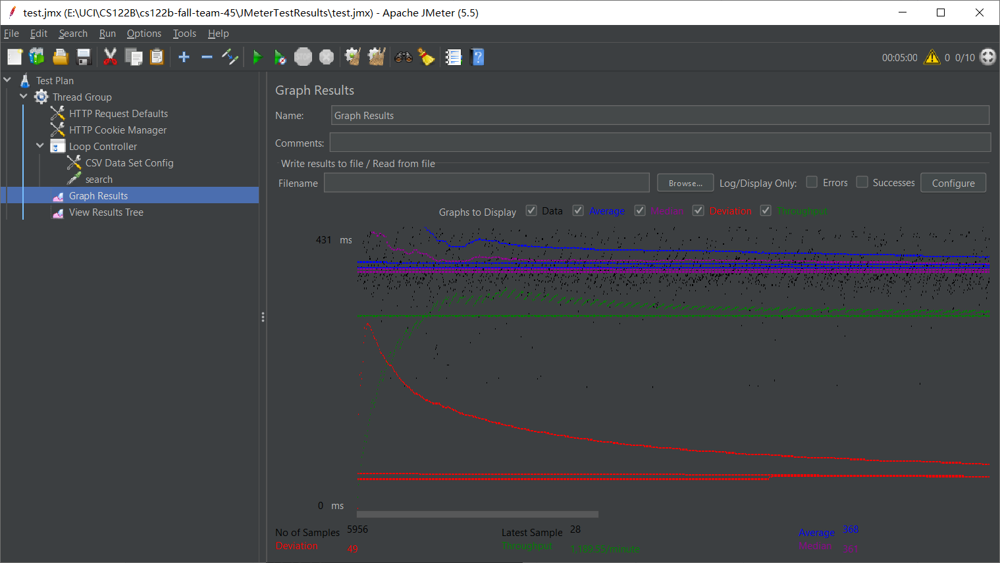
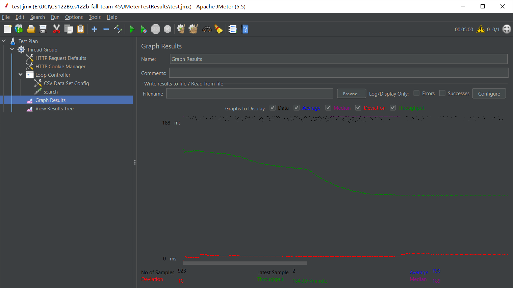
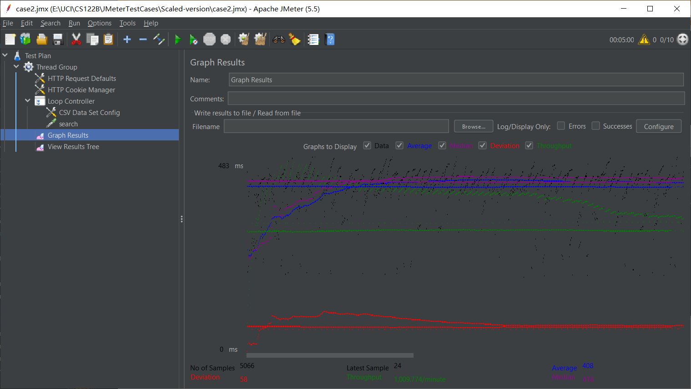

# CS122B Fall2022 Team 45

### Team member:

Zhangjie Chen, Chunji Xu

### Project 1 (URL: http://3.94.197.255:8080/cs122b-fall-team-45/)

1. demo video link: 【UCI CS122b Team45 Project1
   Demo】 https://www.bilibili.com/video/BV1pe4y1E7mV?share_source=copy_web&vd_source=10f88ccb3b503c2350174e54fb5542d3
2. To deploy, type <kbd>mvn package</kbd> in the command line and copy the target/.war file to tomcat/webapps.
3. Contribution:  
   Zhangjie Chen: Main page & Movie List Page front-end & back-end  
   Chunji Xu: Single movie page & Single Star Page front-end & back-end
4. IN CASE FOR MISUNDERSTANDING, we want to mention that the welcome page with all the movies and their posters is NOT
   the movie list. We do select top 20 movies as required on the movie-list page.

### Project 2 (URL: http://23.22.12.155:8080/cs122b-fall-team-45/)

1. demo video link: https://www.youtube.com/watch?v=MbNraniUzJ8
2. Type <kbd>git clone -b master https://github.com/uci-jherold2-teaching/cs122b-fall-team-45.git </kbd> in the command
   line to clone the project, and then type <kbd>mvn package</kbd> in the command line and copy the target/.war file to
   tomcat/webapps to deploy.
3. Substring matching design:
   Using Mysql keyword "like" for query instead of "=", a string that contains certain content can be described as '
   %content%'.
4. Contribution:
   Zhangjie Chen: Login Page, Main Page, Payment Page front end & back end  
   Chunji Xu: Movie List, Shopping Cart front end & back end

### Project 3 (URL: https://34.229.217.233:8443/cs122b-fall-team-45/)

* demo video link: https://www.youtube.com/watch?v=gvE65Ip7Dvg
* Type <kbd>git clone -b master https://github.com/uci-jherold2-teaching/cs122b-fall-team-45.git </kbd> in the command
  line to clone the project, and then type <kbd>mvn package</kbd> in the command line and copy the target/.war file to
  tomcat/webapps to deploy.
* Queries with Prepare Statements:  
  LoginServlet.java(https://github.com/uci-jherold2-teaching/cs122b-fall-team-45/blob/master/src/main/java/org/uci/LoginServlet.java)  
  DashBoardAddMovieServlet.java(https://github.com/uci-jherold2-teaching/cs122b-fall-team-45/blob/master/src/main/java/org/uci/DashBoardAddMovieServlet.java)  
  DashBoardAddStarServlet.java(https://github.com/uci-jherold2-teaching/cs122b-fall-team-45/blob/master/src/main/java/org/uci/DashBoardAddStarServlet.java)  
  PaymentServlet.java(https://github.com/uci-jherold2-teaching/cs122b-fall-team-45/blob/master/src/main/java/org/uci/PaymentServlet.java)  
  MovieListServlet.java(https://github.com/uci-jherold2-teaching/cs122b-fall-team-45/blob/master/src/main/java/org/uci/MovieListServlet.java)
* Two parsing time optimization strategies:
    1. We noticed that it took us a long time to import data into table 'stars_in_movies' because there are many pieces
       of data parsed from cast.xml file. To insert these data(starName, movieId) into our database, we need to query
       for starIds that correspond to the starNames. So if we **create an index on starName**, the query time cost would
       be
       reduced.
       time cost before adding index: 1691553ms

  
  after adding index(create index starName on stars(name)): 587114ms

    2. At first, we check the inconsistency of new data manually using 'select'.
       
       return inconsistency message (example: insert into genres_in_movies)

check inconsistency in Java manually (example: insert into movies)

But this greatly increases the time we access to the database. So we turned to set some unique constraints for tables
and then let these constraints check the inconsistency. The inconsistent data message can be printed by catching
SQLException in our Loader.

  
check inconsistency through exception.

Final version time cost: 12560ms

* Inconsistent data report:
  (https://github.com/uci-jherold2-teaching/cs122b-fall-team-45/blob/master/report.txt)
* Contribution:   
  Zhangjie Chen: added reCAPTCHA & HTTPS, implemented DashBoard
  Chunji Xu: implemented XML parsing

### Project 4(URL: https://54.145.25.56:8443/cs122b-fall-team-45/)

* demo video link: https://studio.youtube.com/video/y3BZBVDtK28/edit
* Type <kbd>git clone -b master https://github.com/uci-jherold2-teaching/cs122b-fall-team-45.git </kbd> in the command
  line to clone the project, and then type <kbd>mvn package</kbd> in the command line and copy the target/.war file to
  tomcat/webapps to deploy.
* Fuzzy search design:
  select movies with similar sound to key words using 'SOUNDEX' in mysql
* Contribution:  
  Zhangjie Chen: Android
  Chunji Xu: Full-text Search, Auto Complete, Fuzzy Search

### Project 5(URL: https://www.youtube.com/watch?v=weE4wQ1G5VA)

- ### General
    - Team#: 45

    - Names: Zhangjie Chen, Chunji Xu

    - Project 5 Video Demo Link:

    - Instruction of deployment: Type <kbd>git clone -b
      master https://github.com/uci-jherold2-teaching/cs122b-fall-team-45.git </kbd> in the command line to clone the
      project, and then type <kbd>mvn package</kbd> in the command line and copy the target/.war file to
      tomcat/webapps to deploy.

    - Collaborations and Work Distribution:

      Zhangjie Chen: JMeter Tests, Log
      Chunji Xu: Connection Pooling, Master/Slave, Load balancing

- # Connection Pooling
    - #### Include the filename/path of all code/configuration files in GitHub of using JDBC Connection Pooling.
      /src/main/java/org/uci/AutocompleteServlet.java

      /src/main/java/org/uci/DashBoardAddMovieServlet.java

      /src/main/java/org/uci/DashBoardAddStarServlet.java

      /src/main/java/org/uci/DashBoardLoginServlet.java

      /src/main/java/org/uci/GenreServlet.java

      /src/main/java/org/uci/LoginServlet.java

      /src/main/java/org/uci/MainPageServlet.java

      /src/main/java/org/uci/MetadataServlet.java

      /src/main/java/org/uci/MovieListServlet.java

      /src/main/java/org/uci/PaymentServlet.java

      /src/main/java/org/uci/ShoppingCartServlet.java

      /src/main/java/org/uci/SingleMovieServlet.java

      /src/main/java/org/uci/SingleStarServlet.java
    - #### Explain how Connection Pooling is utilized in the Fabflix code.
      A number of connections to databases have already set up, we can fetch a connection from the pool in init()
      function of a servlet.

    - #### Explain how Connection Pooling works with two backend SQL.
      Set up connection pool to multiple databses(master and slave), pick a connection to a random database when the
      servlet only requests for read operations, pick a connection to the master database when the servlet requests for
      write operations.

- # Master/Slave
    - #### Include the filename/path of all code/configuration files in GitHub of routing queries to Master/Slave SQL.
      /src/main/java/org/uci/AutocompleteServlet.java

      /src/main/java/org/uci/DashBoardAddMovieServlet.java

      /src/main/java/org/uci/DashBoardAddStarServlet.java

      /src/main/java/org/uci/DashBoardLoginServlet.java

      /src/main/java/org/uci/GenreServlet.java

      /src/main/java/org/uci/LoginServlet.java

      /src/main/java/org/uci/MainPageServlet.java

      /src/main/java/org/uci/MetadataServlet.java

      /src/main/java/org/uci/MovieListServlet.java

      /src/main/java/org/uci/PaymentServlet.java

      /src/main/java/org/uci/ShoppingCartServlet.java

      /src/main/java/org/uci/SingleMovieServlet.java

      /src/main/java/org/uci/SingleStarServlet.java

    - #### How read/write requests were routed to Master/Slave SQL?
      Set up connection pool to multiple databses(master and slave), pick a connection to a random database when the
      servlet only requests for read operations, pick a connection to the master database when the servlet requests for
      write operations.

- # JMeter TS/TJ Time Logs
    - #### To use the `log_processing.*` script, go into the folder JMeterTestResults, type <kbd>g++ log_processing.cpp</kbd> in the command line to generate a executable file, then type <kbd>./a {log_file_path}</kbd> in the command line to show the average result of selected log file.

- # JMeter TS/TJ Time Measurement Report

| **Single-instance Version Test Plan**         | **Graph Results Screenshot**                         | **Average Query Time(ms)** | **Average Search Servlet Time(ms)** | **Average JDBC Time(ms)** | **Analysis**                                                                                                                                                                                              |
|-----------------------------------------------|------------------------------------------------------|----------------------------|-------------------------------------|---------------------------|-----------------------------------------------------------------------------------------------------------------------------------------------------------------------------------------------------------|
| Case 1: HTTP/1 thread                         |  | 187                        | 24.43                               | 24.28                     | When there is only one thread, load is much smaller which results in better performance.                                                                                                                  |
| Case 2: HTTP/10 threads                       |  | 385                        | 212.93                              | 212.81                    | Significantly slower than single thread with 10 times of the number of threads.                                                                                                                           |
| Case 3: HTTPS/10 threads                      |  | 477                        | 197.64                              | 197.49                    | In HTTPS, we have an additional step of SSL handshake unlike in HTTP, so the Average Query Time is a bit longer when using HTTPS                                                                          |
| Case 4: HTTP/10 threads/No connection pooling |  | 368                        | 197.61                              | 197.25                    | JDBC costs less time if we do not use Connection pool, several tests with more threads shows that this happens due to the small request volume, and it is more ideal when load becomes much more heavier. |

| **Scaled Version Test Plan**                  | **Graph Results Screenshot**                        | **Average Query Time(ms)** | **Average Search Servlet Time(ms)** | **Average JDBC Time(ms)** | **Analysis**                                                                                                                                                                                                                                                                                                                                                                                                              |
|-----------------------------------------------|-----------------------------------------------------|----------------------------|-------------------------------------|---------------------------|---------------------------------------------------------------------------------------------------------------------------------------------------------------------------------------------------------------------------------------------------------------------------------------------------------------------------------------------------------------------------------------------------------------------------|
| Case 1: HTTP/1 thread                         |  | 190                        | 25.12                               | 24.90                     | When there is only one thread, load is much smaller which results in better performance.                                                                                                                                                                                                                                                                                                                                  |
| Case 2: HTTP/10 threads                       |  | 408                        | 235.93                              | 235.72                    | The efficiency of scaled version is not superior to the single instance in this case. We checked the tomcat log file of the two backend instances(instance2 and instance3) and found out that all the requests were sent to one single instance. But after the number of thread is increased, both the backend instances received the http requests. So the load balancer can be more effective when the load is heavier. |
| Case 3: HTTP/10 threads/No connection pooling |  | 356                        | 184.51                              | 184.33                    | JDBC costs less time if we do not use Connection pool, several tests with more threads shows that this happens due to the small request volume, and it is more ideal when load becomes much more heavier.                                                                                                                                                                                                                 |
